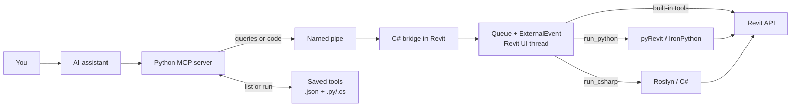

# Revit MCP

Revit MCP lets an AI assistant read and change an open Revit model. The Revit connection and code execution stay on your computer.



Results return through the same path to the AI assistant.

## Saved tools

A saved tool is a proven script stored in:

```text
%LOCALAPPDATA%\RevitMcp\tools\
```

Each tool has a manifest (`name.json`) and a script (`name.py` or `name.cs`). Change the root from **Activity → Settings**.

- `list_saved_tools` reads the files without contacting Revit.
- `run_saved_tool` validates the inputs, then uses the normal `run_python` or `run_csharp` path.
- There is no `save_tool` MCP command. You or the AI assistant create the two files directly.
- Subfolders are groups. Disable a group or one tool from **Activity → Saved**.
- Disable built-in MCP tools from **Activity → Tools**.

## Start

1. Open Revit.
2. Click **Bridge ON**.
3. Click **Python ON** if you want to run Python.
4. Ask the AI assistant to inspect or modify the model.

The three parts are [`revit-mcp`](revit-mcp/), [`revit-c-bridge`](revit-c-bridge/), and [`revit-pyrevit-extention`](revit-pyrevit-extention/).

## Maintenance

- `./doctor.ps1` checks the three installed components, live bridge instances, runtime settings, and drift between the repo and its deployed copies.
- `./sync.ps1` copies server and extension changes to their deployed locations. Bridge changes still need package + install with Revit closed.
