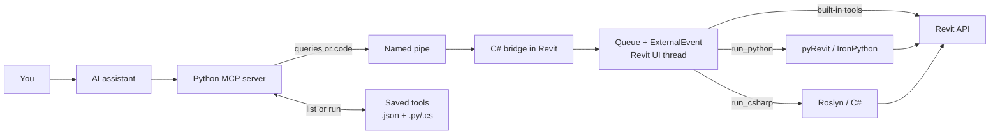

# Revit MCP

Revit MCP lets an AI assistant read and change an open Revit model. The Revit connection and code execution stay on your computer: one current-user named pipe, no network listeners, no cloud service.



Results return through the same path to the AI assistant.

## Components

- [`revit-c-bridge/`](revit-c-bridge/) — C# Revit add-in: named-pipe server, bounded request queue, transaction coordinator, Activity dockable pane, ribbon.
- [`revit-mcp/`](revit-mcp/) — pure-Python 3.12 stdio MCP server; ctypes pipe client, no pywin32, no network.
- [`revit-pyrevit-extention/`](revit-pyrevit-extention/) — pyRevit extension hosting the IronPython 2.7 execution provider.
- [`saved-tools/`](saved-tools/) — prebuilt saved tools, ready to deploy.

Each folder's README has its build, test, and install detail.

## Install

1. Close Revit — the add-in DLL is locked while it runs.
2. Run `./package-v0.9.ps1` once to build and stage the install artifacts (skip if you unzipped a release build).
3. Run `./install-v0.9.ps1 -RevitYear 2025`. No elevation needed.
4. Merge the generated `%LOCALAPPDATA%\RevitMcp\mcp\0.9.0\client-config.json` into your MCP client's configuration.
5. Restart Revit.

Revit 2025 is the live-certified target. 2026 and 2027 build (`-RevitYear 2026|2027`) but are not certified yet.

## Start

1. Open Revit.
2. Click **Bridge ON**.
3. Click **Python ON** if you want to run Python.
4. Ask the AI assistant to inspect or modify the model.

Both switches reset to OFF every Revit session by design — a human click is required each time.

## Saved tools

A saved tool is a proven script stored in:

```text
%LOCALAPPDATA%\RevitMcp\tools\
```

Each tool has a manifest (`name.json`) and a script (`name.py` or `name.cs`). Change the root from **Activity → Settings**.

- `list_saved_tools` reads the files without contacting Revit.
- `run_saved_tool` validates the inputs, then uses the normal `run_python` or `run_csharp` path.
- There is no `save_tool` MCP command. You or the AI assistant create the two files directly.
- Subfolders are groups. Disable a group or one tool from **Activity → Saved**.
- Disable built-in MCP tools from **Activity → Tools**.

Prebuilt tools ship in [`saved-tools/`](saved-tools/); deploy them with `./sync.ps1 -Tools`. Changes are live at the next call.

## Maintenance

- `./doctor.ps1` checks the three installed components, live bridge instances, runtime settings, and drift between the repo and its deployed copies.
- `./sync.ps1` copies server and extension changes to their deployed locations; `-Tools` also copies `saved-tools/`.
- Bridge changes need `revit-c-bridge/scripts/package.ps1`, then close Revit, `scripts/install.ps1`, reopen.
